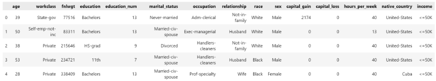
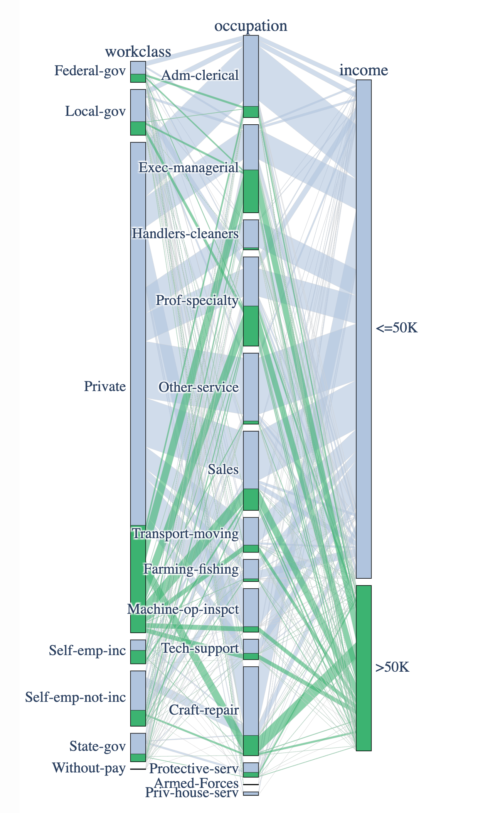

- 目标和业务目标：定义目标和业务目标。
- 数据处理和选择：本节列出数据处理的过程和从 14 个数据类型中选择哪些数据。原因和结果
- 用户场景：列出您为项目选择的用户场景。（你认为上面列出的数据类型和个人收入的关系是什么？为什么你会这么认为？）（每个用户场景对应1-n个可视化）
- 可视化：根据用户场景创建的 12 个可视化。（具体介绍每个可视化，如果几个可视化属于一个场景，可以放在一起介绍）。并总结（你从这个可视化中得到什么信息；是否符合之前的预期；为什么）
- 挑战：这部分列出了您遇到的挑战 以及您实施的解决方案。
- 可选：之后的工作。如果以后继续数据挖掘的工作或学习，你会做什么。
- 附录：在本节中包含引用、您的 Python 代码（复制并粘贴）。

# 项目目标

这是针对 2023 年夏季学期数据可视化的（CSE511）的项目报告。在该项目中，我们以小组为单位，总计需要完成12组针对不同场景的的数据可视化组合，从而以支持完成项目目标

具体而言，则是小组成员分工合作，从课程提供的数据文件种选择九种数据（共计提供15种数据—其中收入（income）为必须选择的数据），既是需要另外选取八种数据，基于这些数据，再结合课程中所学的可视化的具体知识，将这些数据经过合理的处理后，采用所学习的可视化图形将其展示出来，从而达成通过这些数据可视化能够预测人员的收入的项目终极目的。

# 业务目标

XYZ公司使用数据来开发人员的营销档案，然后将这些档案出售给众多公司用于营销目的。我们是XYZ的员工和数据分析团队的成员。我们的团队刚刚获得一个新的项目，要与当地希望扩招学员的UVW大学合作。UVW已经选择将薪资作为关键统计数据，以确定其学位课程的营销标准。我们必须利用美国人口调查局提供的数据开发营销档案，并将 50,000 美元作为薪资的关键数据。对于薪资低于和超过 50,000 美元的人员，要评估许多关键变量，包括年龄、性别、教育背景、婚姻状态、职业等等。

例如，如果数据显示大多数薪资低于 50,000 美元的人员是34岁以下的单身男性，且具有高中文凭，则该大学可通过制定针对适合该人群的学费、课程内容、甚至是线上或线下课程，来向该人群销售课程。

为了达到招生目标，UVW的营销团队想要开发一个应用程序，以找到决定个人收入的因素。为此，一种方法是使用 XYZ 公司提供的美国人口调查局数据。对于在开发所提议的模型/应用程序过程中可以使用到的因素，营销团队希望对其进行分组。并希望利用该应用程序，根据不同输入参数值预测个人收入，以便调整适用于个人的营销方式。

# 数据处理和选择

## 数据处理

在本项目中，我们使用了Adult - UCI Machine Learning RepositoryLinks to an external site数据集，通过对数据文件和字段说明文件的分析，实现了数据的加载以及数据字段的设置，加载完成后的示例数据如下：

拿到数据后，我们首先对数据做了一些预处理和清洗，以便后续的数据分析和可视化。原始数据是csv格式，我们首先将其转换成了pandas的dataframe格式，并且添加列名，方便后续的数据处理。然后我们对数据进行了一些基本的统计分析，包括数据的基本信息，数据的缺失情况，数据的分布情况等等。

我们先对通过对原始数据文件的简单初略的查阅和分析，发现数据文件一共包含15种数据，分别为"age"（年龄）, "workclass"（工作类型）, "fnlwgt"（人口普查员认为观测值的人数）, "education"(教育程度), "education_num"（教育年限）, "marital_status"（婚姻状况）,
"occupation"（职业）, "relationship"（家庭角色）, "race"（种族）, "sex"（性别）, "capital_gain"（资本收益）, "capital_loss"（资本损失）,"hours_per_week"（每周工作时间）, "native_country"（出生国籍）, 以及"income"（收入）。

之后我们对数据进行清洗，主要包括对异常值的过滤以及对特定字段的数据处理，通过分析，我们发现workclass 以及 occupation 两个字段分别存在 5.6% 和 5.7% 的数据缺失（对应柱状图中的?字段）。

过滤掉异常值后，数据量从 32561 减少至 30162，异常数据占比为 7.36%。

完成异常值过滤后，我们对三个特殊字段的数值进行了分桶处理，以方便后续计算与收入的相关性，数据分桶是比较有效的数据转换方法，可以更好的挖掘数值数据的特性，比如针对年龄数据，针对具体的年龄数值很难挖掘出比较明显的特性，但不同年龄段的人群却比较容易发掘出关联，本项目中，我们将年龄字段安装不同的年龄段进行了分桶处理，0-18岁为少年，18-30岁为青年，30-50岁为中年，50-70岁为老年，70岁以上为老老年。受教育年限以及每周工作时长也按照不同的区间划分为了高、中、低三段。

## 数据选择

我们选择了以下14个数据类型作为我们的可视化分析的数据类型，除了 "fnlwgt"（人口普查员认为观测值的人数）之外，都进行了可视化分析：
年龄, 工作类型, 教育程度, 教育年限, 婚姻状况, 职业, 家庭角色, 种族, 性别, 资本收益, 资本损失,每周工作时间, 出生国籍, 收入。

# 用户场景

每个组员负责3个用户场景，我们选择了以下12个用户场景作为我们的分析目标：

组员Hao Wu负责的用户场景：
1. 不同年龄的人，分成10-19、 20-29、30-39、40-49、50-59、60-69、70-79、80-89八个年龄组对其在资本投资的损失(capital_loss)和收益方面(capital_gain)用折线图进行可视化显示。预期：在中间年龄段，有较大的资本收益。进行这个的分析主要是为了确定各个年龄段的投资损益情况，以便确定经济条件合适的年龄人群作为目标对象。
2. 对不同教育（education），了解收入（income）情况，用柱状图进行显示高低收入人所占百分比。以便更直观地展示受教育情况对收入的影响。
3. 使用词云显示不同原生国籍（native_country）和收入（income）的关系。哪些原生国籍高收入占比高，哪些原生国籍低收入占比过高，以便学校据此做好招生。

组员Jin Zhou负责的用户场景：
4. 该策略基于 age, hours_per_week, education_num 三个字段, 创建一个3D散点图，其中 x 轴为 age, y 轴为 hours_per_week, z 轴为 education_num，income 的两种取值用不同颜色表示，通过散点图可以直观的观察高收入和低收入人群在不同象限上的分布情况。
5. 该策略基于离散类型的字段 "relationship", "race", 采用热力图来进行可视化展示，在不同的变量取值组合下，高收入人群的比例越高，图像的颜色越深，反之则越浅。通过观察图像的深度变化，可以分别发掘出与高收入和低收入人群最相关的变量组合。
6. 该可视化策略基于使用relationship, age_catrgory, education, race, occupation等相对区分度较高的变量，使用了平行坐标图可视化发掘各变量之间的关系。

组员Yi Wang负责的用户场景：
7. 此可视化使用词云展示职业（occupation）和收入（income）。我们预期不同的职业，会有不同的收入分配，高收入者分布于一种或者某几种确定的职业。
8. 此可视化使用堆叠条形图，展示性别（sex）, 教育程度（education）, 每周工作时间（hours_per_week）。我们预期具有不同教育程度，以及不同的性别的每周工作时间长度应当是不同的，必然有一些教育背景下的人群，其周工作时间长度是比较短的。
9. 此可视化使用气泡图（一种变形的散点图），展示婚姻状况（marital_status），工作类型（workclass）, 年龄（age）。我们预期不同的年龄，不同的工作类型的人群的婚姻状况，具有显著的较大差异，根据经验，一般认为，工作类型不太稳定（比如在私有企业工作）的年轻人群一般属于未婚状态。

组员Zhenya Zhu负责的用户场景：
10. 使用平行坐标图，展示职业（occupation）和工作类型（workclass）对收入（income）的影响。职业和工作类型是和收入最直接相关的信息，我们希望能揭示他们之间的关系，确定目标人群的职业。我们预期高技能要求的职业和管理职业应该会比其他职业收入高。另外政府雇员和私企哪个收入高是很有意思的一点。
11. 使用树状图（treemap），展示职业（occupation）和出生国籍（native-country）的关系，展现每种职业里国籍分布有多少。上一个可视化确定了目标职业，这一个可视化希望通过确定目标职业的主要国籍，来更好地制定营销策略，以更好地覆盖目标人群。我们预期不同国家的人在就业时有类似偏好，如中国人可能专业技术类职业较多。
12. 原打算是使用基于像素的图，展示职业（occupation）和教育程度（education）的关系，后面发现堆叠条形图更加合适。这个可视化，我们希望在获得高收入职业之后，通过挖掘职业和教育程度之间的关系，我们可以得到目标职业的大部分人受教育程度是多少，以此推出相应下一阶段的教育课程，比如如果一个群体大部分人是高中毕业水平，那么推出大学水平课程就会比较受欢迎。另外我们也可以得到低教育群体的在哪些职业占比多，以推出相应的职业课程，提高他们的受教育程度，以提升他们的竞争力。我们预期高收入职业群体的教育程度应该比较高。

# 数据可视化

对于上面的12个用户场景，我们分别使用了不同的可视化方法进行了可视化，包括折线图、柱状图、词云、3D散点图、热力图、平行坐标图等等。

可视化的jupyter notebook在随本文档提交的文件夹中。

下面是我们的可视化结果：

组员Hao Wu负责的可视化：

## 1. 各年龄的投资损益折线图

不同年龄的人，分成10-19、 20-29、30-39、40-49、50-59、60-69、70-79、80-89八个年龄组对其在资本投资的损失(capital_loss)和收益方面(capital_gain)用折线图进行可视化显示。预期：在中间年龄段，有较大的资本收益。进行这个的分析主要是为了确定各个年龄段的投资损益情况，以便确定经济条件合适的年龄人群作为目标对象。

通过折线图我们看到，资本投资收益情况：60-69年龄组略有下降，在80-89年龄组大幅度下降。资本投资损失情况在50-59年龄组和60-69年龄组也有下降。
是否美国退休年龄和最早领取退休金年龄都是65岁。美国平均寿命77-78岁，考虑到进行资本投资的高收入人比例较多，平均寿命还会有一定的加大。

## 2. 各教育水平的高低收入百分比的柱状图

对不同教育（education），了解收入（income）情况，用柱状图进行显示高低收入人所占百分比。以便更直观地展示受教育情况对收入的影响。

通过柱状图看到随着受教育程度的提高，50K年薪以上收入的比重都在增加（甚至PreSchool学前教育组没有50K以上占比为0）。
而且在接受过大学教育、学士、硕士、博士也是高收入占比逐步提高。
另外看到一个有意思的现象博士和教授的高收入者占比几乎是一样得（看来这是一个几乎平行或者几乎重叠的群体）。
因此教育是如此的重要（美国也是一个尊重知识的资本主义国家）。

## 3. 去除US后各原生国家人口在总体、高收入及低收入中的情况的词云

使用词云显示不同原生国籍（native_country）和收入（income）的关系。哪些原生国籍高收入占比高，哪些原生国籍低收入占比过高，以便学校据此做好招生。

比较有意思的族群：
墨西哥在总的人口中占比最高，在收入<50K人口中占比也是最高，但是在50K以上人口中占比明显缩小（在排名前三只有），那么说明原生墨西哥的人口低收入者较多，高收入者较少。
另外在50K以上的高收入人口中菲律宾、德国、意大利、英格兰、中国等亚洲和欧洲国家人口占比比在总体人口占比中要高。是UVW大学招生特别要关注的人群。
萨尔瓦多、波多黎各等中南美洲的人口明显在低收入占比高于在总提人群中的占比。

组员Jin Zhou负责的可视化：

## 4. 对于年龄、周工作小时、受教育时间、收入的3D散点图

该策略基于 age, hours_per_week, education_num 三个字段, 创建一个3D散点图，其中 x 轴为 age, y 轴为 hours_per_week, z 轴为 education_num，income 的两种取值用不同颜色表示，通过散点图可以直观的观察高收入和低收入人群在不同象限上的分布情况。

通过分析，该可视化策略的结果符合预期，低收入的人群主要集中在年龄较小或较大，工作时长短、且受教育年限短的区间；高收入的人群则主要集中在青壮年、每周工作时长较长且受教育年限较多的区间。

## 5. 对于家庭关系、种族、收入的热力图

该策略基于离散类型的字段 "relationship", "race", 采用热力图来进行可视化展示，在不同的变量取值组合下，高收入人群的比例越高，图像的颜色越深，反之则越浅。通过观察图像的深度变化，可以分别发掘出与高收入和低收入人群最相关的变量组合。

通过分析，从该热力图中可以看出，White+Wife 以及 Asian-Pac-Islander+Husband 的变量组合高收入占比最高，black+Own-child 以及 black+Other-relative 的变量组合低收入占比最高。

## 6. 对于家庭关系、年龄阶段、教育程度、种族、职业的平行坐标图

该可视化策略基于使用（relationship, age_catrgory, education, race, occupation）等相对区分度较高的变量，使用了平行坐标图可视化发掘各变量之间的关系

通过平行坐标图，可以看出，高收入人群相关性更强的变量组合包括：relationship-husband, relationship-wife, age-middle, age-old 以及 race-white。
低收入人群相关性最强的变量组合包括： relationship-ownchild, age-veryold, age-child, education-1st-4th, 以及 race-other.

Jin Zhou同学通过以上的3个数据可视化策略的构建，挖掘出了以下与收入密切相关的变量以及变量组合：

=== Jin Zhou 替换===

变量或变量组合	预估收入
age(<20 or >60) + education_num(<6) + hours_per_week(<40)	<50K
age(30 ~ 50) + education_num(>8) + hours_per_week（>60）	>50K
Race（White）+ Relationship(Wife)	>50K
Race(Asian-Pac-Islander) + Relationship(Husband)	>50K
Race（Black）+ Relationship(Own-child, Other-relative)	<50K
Relationship(husband,wife) + age(middle,old) + race(white)	>50K
Relationship(own-child) + age(child, very-old) + education(1st-4th) + race(other)	<50K
=== Jin Zhou 替换===

组员Yi Wang负责的可视化：

## 7. 对于职业和收入的词云

此可视化使用词云展示职业（occupation）和收入（income）。将数据按照>50k和≤50K区分后，通过词云图形，分别统计不同的职业的数据总量，然后将数据整理后，再通过词云进行展示出来，其效果如下图所示

如图1所示，我们可以明显地看到EXEC-MANAGERRIAL,PROF-SPECIALTY等职业在>50k的人群中的占比是比较高的，说明这几种职业的高收入人群比例最大。

## 8. 对于性别、教育、周工作时间和收入的堆叠条形图

此可视化使用堆叠条形图，展示性别（sex）, 教育程度（education）, 每周工作时间（hours_per_week）。将数据按照男性、女性进行划分，然后分别统计不同教育的人群的周平均工作时间，然后按照教育，将男性和女性周平均工作时间合并为一条条形图进行展示。其所示的效果图如下

如图2所示，我们可以明显地看到11th, 12th的人群的工作时间最短，doctorate的人群的工作时间最长，总体而言，男性的工作时间比女性较长。

## 9. 对于婚姻状况、工作类型和年龄的气泡图

此可视化使用气泡图（一种变形的散点图），展示婚姻状况（marital_status），工作类型（workclass）, 年龄（age）。将数据按照婚姻状况和工作类型进行分类，并计算各类人群的平均年龄，之后将整体人群按照年龄划分为3个大的群体，年轻，中等，偏大。然后，将其通过气泡图进行展示，其展示的效果图如下所示

如图3所示（Word中显示不佳，可具体参看代码文件中的图示）。

其中，横轴所示为婚姻状况，纵轴所示为工作类型，气泡大小代表着人数的多少，颜色代表年龄分布（红色：年轻；蓝色：中等；绿色：偏大（年龄划分较为粗略））。
通过以上图示，我们可以发现，private的人群最多，而这个群体中，年轻人基本为未婚状态，中年人大部分为married-civ-spouse。

基于以上3种数据组合的简单分析和可视化，我简单认为，应当选取职业为EXEC-MANAGERRIAL,PROF-SPECIALTY的教育程度为11th,12th的工作性质为private中的年轻人群体为最佳目标客户，因为这样的人群具有较高的收入，较多的自由时间，同时又没有家庭的束缚，无疑是满足目标的最佳选择。

组员Zhenya Zhu负责的可视化：

## 10. 职业和工作类型对收入的影响

在这个可视化中，我们使用平行坐标图，展示职业（occupation）和工作类型（workclass）对收入（income）的影响。职业和工作类型是和收入最直接相关的信息，我们希望能揭示他们之间的关系，确定目标人群的职业。我们预期高技能要求的职业和管理职业应该会比其他职业收入高。另外政府雇员和私企哪个收入高是很有意思的一点。

上面的平行坐标图，符合我们之前的预期，高技能要求的职业和管理职业的收入确实比其他职业高。

下面是具体分析：
- 按雇主/雇佣类型分类
    - 私企人数最多，是一个比较大的群体，适合作为课程的目标人群
    - 政府雇员（包括联邦雇员、州雇员、本地雇员）的高收入人群比例更高，他们的收入更稳定，但是人数较少
    - 自雇人群(self-emp-inc和self-emp-not-inc)的高收入人群比例也很高，他们主要是自我雇佣的医生、律师、建筑师、咨询顾问、小企业所有者、自雇专业人员、自我雇佣的艺术家、作家和表演者、自我雇佣的技工等等。他们的收入较高，但是人数较少。可以针对性地为他们开发高单价的课程
- 按职业分类
    - 管理人员、专业技术人员的高收入人群比例较高。我们可以为其开发高单价的课程
    - 行政办公室人员、保洁人员、销售人员、技术支持人员、手工艺人、渔牧人员、机器操控人员等等的高收入人群比例较低。适合为其开发低单价的课程

## 11. 职业和出生国籍的树状图

这个可视化，我们使用树状图（treemap），展示职业（occupation）和出生国籍（native-country）的关系，展现每种职业里国籍分布有多少。上一个可视化确定了目标职业，这一个可视化希望通过确定目标职业的主要国籍，来更好地制定营销策略，以更好地覆盖目标人群。我们预期不同国家的人在就业时有类似偏好，如中国人可能专业技术类职业较多。

这是一个交互式树状图，可以点击相应的矩形，进入到对应的层级。鼠标移动到矩形上，可以看到具体的数据，如树枝路径和案例个数。

评述和总结：上面的树状图，总体上符合之前的预期，不同国家人的就业偏好不同。只是美国人在所有职业中都占大多数，所以我添加了一个排除美国人的树状图，来分析其他国家人在职业中的占比。

具体分析：
- 专业技能工作者中，除美国人之外，印度、德国、菲律宾、加拿大、中国占比较多。说明了这些国家的人在专业技能方面的竞争力较强。我们可以在开发相关专业技能课程时，优先提供印度、德国、菲律宾、中国等国家语言的字幕，并且营销上覆盖到这些国家的人群。
- 高管中，除美国人之外，英格兰、德国、日本、加拿大 等传统发达国家占比较多，并且古巴、墨西哥人也有一定比例。我们可以在开发管理类课程时，优先提供德国、日本、古巴、墨西哥等国的语言字幕，并且营销上覆盖到这些国家的人群。
- 墨西哥人在多个较低收入的职位中占比为第一，如手工业者、机器操作员、行政文书岗位、清洁工、渔牧业、交通运输业、销售、私人安保等等。说明了墨西哥因为和美国接壤，移民到美国的低收入群体较多。我们可以以墨西哥人为目标，为他们提供相应的职业培训，以提高他们的收入

## 12.职业和教育程度的堆叠条形图

第三个可视化，原打算是使用基于像素的图，展示职业（occupation）和教育程度（education）的关系，后面换成了堆叠条形图。在获得高收入职业之后，通过挖掘职业和教育程度之间的关系，我们可以得到目标职业的大部分人受教育程度是多少，以此推出相应下一阶段的教育课程，比如如果一个群体大部分人是高中毕业水平，那么推出大学水平课程就会比较受欢迎。另外我们也可以得到低教育群体的在哪些职业占比多，以推出相应的职业课程，提高他们的受教育程度，以提升他们的竞争力。我们预期高收入职业群体的教育程度应该比较高。

在分析过程中，我发现像素图不适合用来可视化教育程度和职业，因为教育程度的类型较多，有16个，用像素图用户会迷失在不同的教育类型中。而如果使用堆叠柱状图，因为它的顺序性更强，更加契合教育程度的天然顺序性，便于比较。

具体分析：
- 教育程度最高的（大量学士、一些硕士和博士）：专业技术人员和高管。他们是较重视教育的人群，根据之前的分析，他们的收入也是最高的，所以我们可以为他们开发高单价高教育水平的课程，例如硕士和博士课程。
- 教育程度中等的（大量高中毕业、一些学士、少量硕士）：安保警察（protective-serv）、销售、技术支持、军队（Armed-Forces）。可以为他们开发学士和硕士课程。
- 教育程度较低的（大量高中毕业、职业学校、少量学士）：行政文书、清洁工、机器操作员、手工业者、渔牧业、交通运输业、私人住宅服务。可以为他们开发学士或职业学校课程。

综合10、11、12三个可视化，我们可以得到以下结论：
- 专业技术人员和高管的收入最高，他们的教育程度也是最高的，所以我们可以为他们开发高单价高教育水平的课程，例如硕士和博士课程。专业技术人员美国、印度、德国、菲律宾、加拿大、中国等国人数较多；高管中美国、英格兰、德国、日本、加拿大等发达国家人数占比较多。我们在开发面向他们的课程时，应该优先提供相应的语言字幕，并且营销上覆盖到这些国家的人群。
- 安保警察、销售、技术支持、军队等职业的收入中等，他们的教育程度也是中等的，所以我们可以为他们开发学士和硕士课程。行政文书、清洁工、机器操作员、手工业者、渔牧业、交通运输业、私人住宅服务等职业的收入较低，他们的教育程度也是较低的，所以我们可以为他们开发学士或职业学校课程。这些课程的价格不应该过高，应该和他们的收入水平相匹配。从业人员很多人是墨西哥人，所以我们可以为他们提供西班牙语字幕，以及针对墨西哥人的营销活动。

# 问题与挑战

在本项目中，利用数据可视化来进行重要变量的挖掘以及尝试对收入情况进行预估时,我们发现了如下几个问题与挑战：
1. 数据质量的判定：目前的数据清洗技术只能过滤掉存在明确异常值的数据，但对于数值正常但可能存在信息错误的数据没有特别明确的判定手段，比如在本项目的数据集中，capital_gain 和 capital_loss 两个字段的数据过于稀疏，99%以上数据为0，但我们也没有确定的手段来判定这两个字段的数据是否完全不可用。
2. 变量挖掘的覆盖面问题：目前基于可视化分析得到的关键变量以及变量组合都是基于分析人员对于可视化结果中存在的特别明显的分布差异总结得来的，但在真实的收入预估场景下，能够满足这些特定条件的用户有限，只能覆盖很小一部分用户。
3. 预估结果的准确性提升问题：目前基于可视化方法总结得到的预估策略，在预估的准确性上存在一定瓶颈，很难再进一步提升。
4. 如何选择最佳的可视化目标和方法：数据集中包含大量的数据类型，应该当选用哪些数据机型数据可视化分析。另外连续性的数据量比较少，大量的数据属于定类数据，对于多变量的数据可视化具有一些困难。对于数据的选择，首先将数据集中的数据加以简单分析，在去除必要和不理解的数据之后，在结合场景的设定，适当的选取将要使用的数据。对于数据的可视化的展示的过程中，可能需要首先将数据通过python进行合理的处理之后，然后再根据新的数据的特点，再结合可视化图形的特点，最后才决定将哪些数据类型结合在一起进行展示。

# 后续工作计划

针对用户收入预估的任务，在真实的应用场景下一般会基于前期数据分析以及可视化的基础，进行特征的评估和筛选，然后利用机器学习模型来进行建模。在本次任务场景下，后续我们可以基于各个特征变量，利用机器学习模型来构建一个二分类器，用于预估用户的收入是 “>50k” 还是 “<50K”。
相比于基于可视化分析总结得到的关键特征变量，采用机器学习模型的方式有如下优点：
(1) 自动化特征提取：机器学习算法能够自动从原始数据中提取关键特征，无需人工干预。相比较而言，基于数据可视化的方法需要人工进行特征的选择和提取。
(2) 能够发现非显性特征：机器学习算法可以通过学习数据中的模式和关联性，发现非显性的特征。这些特征可能对于分类任务非常重要，而且很难通过简单的可视化方法发现。
(3) 能够处理大规模数据集：机器学习方法可以有效地处理大规模数据集，即使是具有高维度的数据。相比之下，基于数据可视化的方法有时候可能会受到数据规模的限制。
(4) 可以适应复杂模式和非线性关系：机器学习算法可以建模和捕捉复杂的模式和非线性关系，从而更好地进行分类。而基于数据可视化的方法往往只能处理简单的模式或线性关系。
(5) 鲁棒性和泛化能力：通过机器学习训练的分类器通常具有较好的泛化能力，即可以处理未曾见过的数据样本并做出准确的分类。这使得分类器具有一定的鲁棒性，相对不容易受到异常数据的干扰。

# 附录
https://archive.ics.uci.edu/dataset/2/adult